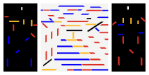

+++
title =  "Recreating Bart van der Leck's Composition 1916 no. 4"
date = 2024-12-09
tags = ["Art"]
authors = ["Richard"]
bannerCaption = "Bart van der Leck's Composition 1916 no. 4"
summary = """
Ever since seeing Bart van der Leck's painting Composition 1916 no. 4 in the Kröller Müller museum I have wanted to recreate it.
In this post we explore how I managed to do that in Inkscape and what problems I ran into.
During the recreation I also developed the color palette for this website.
"""
+++

I have been a big fan of De Stijl and its color palette for quite some time now.
Its simple, minimalistic but colorful visuals really resonate with me.
However, there is still much for me to discover about all artists who were part of De Stijl.

In the summer of 2023 I went to the Kröller Müller museum. There I learned from Bart van der Leck and I saw his painting.
This painting had all the cool elements of a De Stijl painting, but also felt quite unique to me.
So I decided I wanted to recreate it, but it took some time to find the motivation to actually do it.

Recently I did find the motivation and decided to recreate it in Inkscape. 
My bedroom could use a some extra decoration and I want to get better at Inkscape. 
Let's get started!

## A noob vs. Inkscape
My strategy was as follows:
Use the picture from the picture [archive](https://krollermuller.nl/bart-van-der-leck-compositie-1916-no-4) of Kröller Müller and then set it as a background in Inkscape.
The idea was that I could to trace out all the lines, and recreate the painting as an SVG.

Rather soon I found out that my skills in Inkscape were very lacking.
Line parts in the painting which were equally thick, turned out non-equally shaped in my recreation. 
Likewise, some angles which were supposed to look the same, didn't look the same in my work.

What happened was the following.
I tried replicating some shapes, by creating a rectangle, and then trying to skew it to a trapezium with a simple matrix manipulation.
This was fine for some shapes, but some shapes just weren't a skewed rectangle.
Furthermore, just coming up with some angle and hoping it will fit, just wasn't cutting it.

Therefore, I tried following the stackexchange approach for [creating trapeziums](https://graphicdesign.stackexchange.com/questions/98504/inkscape-how-can-i-create-a-rectangle-trapezium-due-to-the-height-base-and-in).
This seemed to solve most of my problems.
However, when one stretches a trapezium in one dimension, within Inkscape, the angles also get transformed in some way.
Thus, whenever two trapeziums had the same angle, but different widths, I couldn't easily transform one into the other.

The usage of helper lines as described in the stackexchange answer gave me an idea:
what if I trace each side of the shape separately and then remove line-parts sticking out:

I didn't know how to do this, but with a quick internet seach I found out this seemed quite possible.
First, trace out each side of the shape.
Then drag your cursor to select all four lines.
Lastly _fracture_ the shape by pressing Alt + Shift + F while the selection is still active.
Using this approach I could duplicate slanted lines so that the slanted sides of multiple adjacent trapeziums had the same angle.

Once I figured that out, progress was rather quick.

## A noob vs Bart van der Leck
During this process something odd was becoming clear.
The lines weren't as straight as they seemd.
And this was clearly showing:

This could either be because the photographer of the painting wasn't perfectly angled towards the painting, making the whole image skewed.
However, it could be that Bart van der Leck had never painted these lines as straight as possible.

And thus I wondered: were these non-straight lines intentional?
Were the unaligned lines intentional?
Should I try to recreate what was painted, or should I recreate the intention?
Could I even know what van der Leck's intention was?
Or should I just try to make something that _feels_ right to me?
After this short but intense philisophical intermezzo, I decided to go for the latter.
So whenever multiple trapeziums were painted next to each other, I gave them the same angle.

At other times, when three objects seemed to be somewhat on the same line, but they weren't directly next to each other, I just traced the existing painting.

## CSS'ing your SVG
After all these decisions the result was looking like this:

The colors present here were the colors I had always used in my LaTeX templates during university.
However, they were looking quite dim.
I did not know what colors would feel right, so I needed a way to experiment with this.
Therefore, I had to be able quickly edit all shapes with the same color and seeing the result immediately. 
It turns out that parametrized SVG's are only partially a thing and that using CSS for parametrizing your SVG is more widely done.
So, I looked up a way to add classes to your SVG shapes.

Again, [stackexchange](https://graphicdesign.stackexchange.com/questions/105884/managing-styles-with-css-classes-in-inkscape) came to the rescue.
After each group of shapes had their own class, I could open the SVG in Firefox and use inspect element to change the color.

Eventually I ended up on what you can see in .
You might recognize the colors being used there!
If you want, you can open the image in a new tab and press F12.
Then you can change the `fill` value for the `bvdl-red`, `bvdl-blue` and `bvdl-yellow` classes and see what color combination you like most.

Now I went to a shop which was able to print it all out on canvas.
They had a few minor problems with sizing the canvas and wrapping it around the frame exactly as I wanted them to.
But all in all, I am quite happy with the end result.
